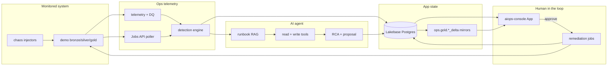

# Autonomous AI Ops Platform

AI agent that investigates Databricks pipeline failures: detect → gather evidence →
write an RCA → propose a fix → human approves → remediate → resolve.

> Start with [`PROJECT_BRIEF.md`](PROJECT_BRIEF.md). Plan:
> [`docs/planning/capstone-implementation-plan.md`](docs/planning/capstone-implementation-plan.md).
> Production checklist: [`docs/planning/production-checklist.md`](docs/planning/production-checklist.md).

## Architecture



**Deployment path A:** Lakebase + Databricks App + CTAS/MERGE analytics into `ops` Delta.

## Measured results

| Metric | Result | Source |
|---|---|---|
| Detection precision / recall | **1.0 / 1.0** (6/6 classes) | [`docs/metrics/phase3_scorecard.json`](docs/metrics/phase3_scorecard.json) |
| Agent RCA rubric (6×3) | **mean 2.0 / 2**, **0** zeros | [`docs/metrics/phase4_scorecard.json`](docs/metrics/phase4_scorecard.json) |
| Full loop (inject→resolve) | **exit_criteria_met** | [`docs/metrics/phase5_scorecard.json`](docs/metrics/phase5_scorecard.json) |
| Simulated MTTR (auto prove) | **≪ 2 min** open→resolved | Lakebase `incident_status_events` on prove incident |
| Manual baseline (narrative) | **hours** of log/schema/commit digging | Bootcamp framing — replaced by the agent loop |

## Live workspace pointers

| Resource | Value |
|---|---|
| Host | `https://dbc-da72c144-83db.cloud.databricks.com` |
| App | https://aiops-console-7474653382320337.aws.databricksapps.com |
| Code folder | `/Workspace/Users/sandeeptidke.work@gmail.com/autonomous-ai-ops-platform` |
| Bundle root (dev) | `/Workspace/Users/.../.bundle/autonomous-ai-ops-platform/dev` |
| Lakebase | `aiops-lakebase` (PG 16) |
| SQL warehouse | `4a3ce36aae2d0b64` |

## Bootcamp coverage map

| Requirement | Implementation |
|---|---|
| Spark pipeline | `src/demo/` medallion + `demo-medallion-pipeline` |
| GitHub + Slack + LLM | commit correlation, Slack webhook notifier, LiteLLM (Groq/Gemini) |
| Unstructured data | task logs, review text, runbook Markdown → `ops.gold.runbook_embeddings` |
| Databricks App | Streamlit `app/` → `aiops-console` |
| Read/write agent | `src/agent/tools_*.py` + LangGraph wrapper |
| Lakebase → Delta analytics | `ops-sync-analytics` + Analytics page |

## Repo layout

```
databricks.yml                 # Asset Bundle (13 jobs)
resources/                     # Job YAML + lakebase_schema.sql
notebooks/{demo,ops}/          # Job entrypoints
src/{demo,ops,detection,chaos,agent,remediation,common}/
app/                           # Streamlit Databricks App
docs/runbooks/                 # RAG corpus
docs/metrics/                  # Phase scorecards
docs/demo-script.md            # 5–8 min recording outline
tests/                         # pytest (local Spark + mocks)
```

## Local development

```bash
python -m venv .venv && source .venv/bin/activate
pip install -r requirements.txt pyspark
cp .env.example .env   # fill secrets locally — never commit
pytest -q
ruff check src tests
sqlfluff lint resources/lakebase_schema.sql
```

## Databricks setup (stranger-operable)

1. Auth: `databricks auth login` (or `~/.databrickscfg` profile `DEFAULT`).
2. Apply Lakebase DDL: run `resources/lakebase_schema.sql` against `aiops-lakebase`.
3. Sync or deploy code:
   ```bash
   databricks bundle validate -t dev
   databricks bundle deploy -t dev
   ```
4. Seed demo data: `databricks bundle run demo_medallion_pipeline -t dev`
5. Embed runbooks: `databricks bundle run ops_embed_runbooks -t dev`
6. Deploy app source from `app/` (see Phase 5) or reuse `aiops-console`.
7. Secrets (Slack / GitHub / Gemini / Groq): follow [`docs/operations/secrets-setup.md`](docs/operations/secrets-setup.md)
   and `scripts/put-aiops-secret.sh`. Jobs load scope **`aiops`** automatically.

### Operator demo (one failure)

```bash
databricks bundle run ops_chaos_inject -t dev          # widget: null_spike
databricks bundle run ops_incident_detection -t dev
databricks bundle run ops_run_agent -t dev              # pass incident_id
# Approve in aiops-console → ops-remediate runs → RESOLVED
databricks bundle run ops_sync_analytics -t dev
```

Or one-shot: `databricks bundle run ops_phase5_prove -t dev`.

Recording outline: [`docs/demo-script.md`](docs/demo-script.md).

## Hard constraints

- Databricks **Free Edition** only (path A; fallbacks in plan §8b)
- No destructive auto-remediation without human approval
- No model fine-tuning — prompted agent + RAG (hash embeddings if no API key)
